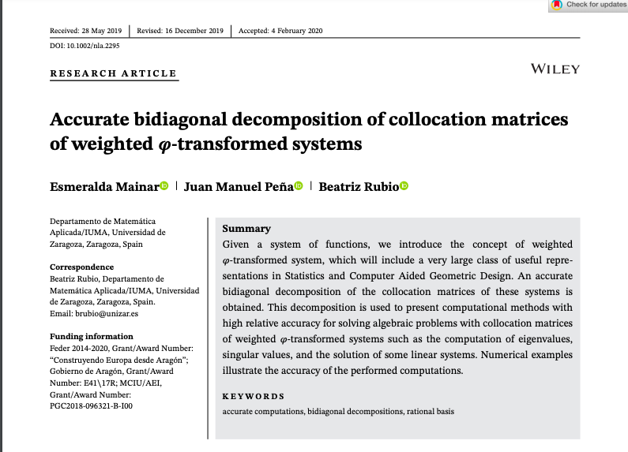

# Accurate bidiagonal decomposition of collocation matrices of weighted φ-transformed systems

In this repository, the bidiagonal decompositions (BDA) of collocation matrices of different weighted φ-transformed systems are provided.

1. In [Weighted_Distribution](https://github.com/BeatrizRubio/Article_NLAA_2020/tree/main/Weighted_Distribution) the bidiagonal decompositions of the collocation matrices of  different distributions are provided. 
2. In [Weighted_general_rational_bases](https://github.com/BeatrizRubio/Article_NLAA_2020/tree/main/Weighted_rational_bases/General_rational_basis) the bidiagonal decomposition of the collocation matrices of a general class of rational bases are provided.
3. In [Weighted_particular_rational_bases](https://github.com/BeatrizRubio/Article_NLAA_2020/tree/main/Weighted_rational_bases/Particular_rational_basis) the bidiagonal decomposition of the collocation matrices of a particular class of rational bases are provided.
4. In [Curve_fitting_HRA_general_rational_bases](https://github.com/BeatrizRubio/Article_NLAA_2020/tree/main/App_CurveFittingHRA/Curve_fitting_HRA_general_rational_bases) a Matlab application is provided. In the article "Accurate bidiagonal decomposition of collocation matrices of weighted φ-transformed systems" we have obtained algorithms for the computation of the bidiagonal decomposition  of square collocation matrices  of a general class of rational bases (see 2). Now, we generalize the mentioned bidiagonal decomposition to the case of rectangular collocation matrices and we provide an accurate algorithm for least square fitting. Thus, in this application, we show the perfomance of this algorithm  with different set of data points belonging to known curves which reflect the variety of situations where the proposed algorithm can be applied.
5. In [Curve_fitting_HRA_particular_bases](https://github.com/BeatrizRubio/Article_NLAA_2020/tree/main/App_CurveFittingHRA/Curve_fitting_HRA_particular_rational_bases) a Matlab application is provided. In the article "Accurate bidiagonal decomposition of collocation matrices of weighted φ-transformed systems" we have obtained algorithms for the computation of the bidiagonal decomposition  of square collocation matrices  of a particular class of rational bases (see 3). Now, we generalize the mentioned bidiagonal decomposition to the case of rectangular collocation matrices and provide an accurate algorithm for least square fitting. Thus, in this application, we show the perfomance of this algorithm  with different set of data points belonging to known curves which reflect the variety of situations where the proposed algorithm can be applied.

In all the experiments we use the Matlab functions available in http://math.mit.edu/~plamen/software/TNTool.html.

The implementation uses Matlab 2020b.

